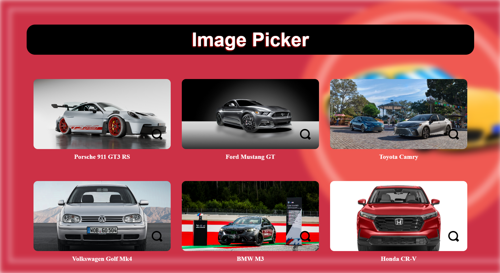
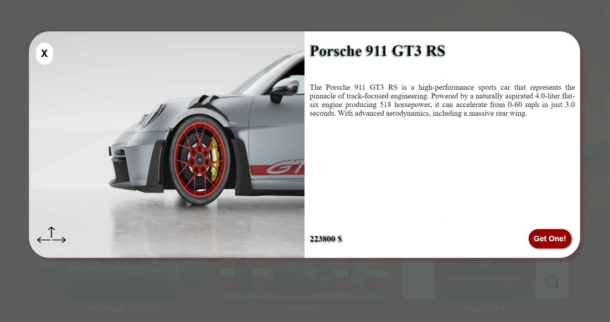

<div id="top"></div>


<!-- PROJECT LOGO --> <br /> <div align="center"> <a href="#">  </a> <h1 align="center">StencilJS Image Gallery</h1> <p align="center"> A responsive and dynamic image gallery built with StencilJS. <br /> <a href="https://main--image-gallery-components.netlify.app/">View Demo</a> </p> </div> 

This project is an image gallery built using StencilJS Components.The gallery consists of three main components: the gallery container, individual image elements, and a popup for viewing images and specific details. The components are designed to be reusable, customizable, and responsive.




<h2>Components</h2>

<h3>Image Gallery Container</h3>

This component wraps the entire gallery and arranges the images in a grid layout.

<h3>Image Element</h3>
Each image in the gallery is an instance of this component. Clicking an image triggers the popup component.

<h3>Image Popup</h3>
This component displays a larger version of the selected image along with details when an image is clicked.



<br>

Built With
StencilJS
TypeScript
CSS3
Node.js
<p align="right">(<a href="#top">back to top</a>)</p>
<!-- GETTING STARTED -->
<h2>Getting Started</h2>

To get a local copy up and running, follow these steps.

Clone the repo

```
git clone https://github.com/your-username/image-gallery.git
```
Go to project folder

```
cd image-gallery
```
Install dependencies

```
npm install
```

Run the development server

```
npm start
```

Tree Structure

```
image-gallery
|   .editorconfig
│   .gitignore
│   .prettierrc.json
│   LICENSE
│   package-lock.json
│   package.json
│   tsconfig.json
│   readme.md
│   stencil.config.ts
├───src
│    ├───components
│    │   ├───image-gallery
│    │   │       image-gallery.tsx
│    │   │       image-gallery.css
│    │   ├───image-element
│    │   │       image-element.tsx
│    │   │       image-element.css
│    │   └───image-popup
│    │           image-popup.tsx
│    │           image-popup.css
│    ├───assets
│    ├───global
│    ├───utils
│    ├───_redirects
│    ├───components.d.ts
│    ├───index.html
│    ├───index.ts
│
├───assets
```

<p align="right">(<a href="#top">back to top</a>)</p>
